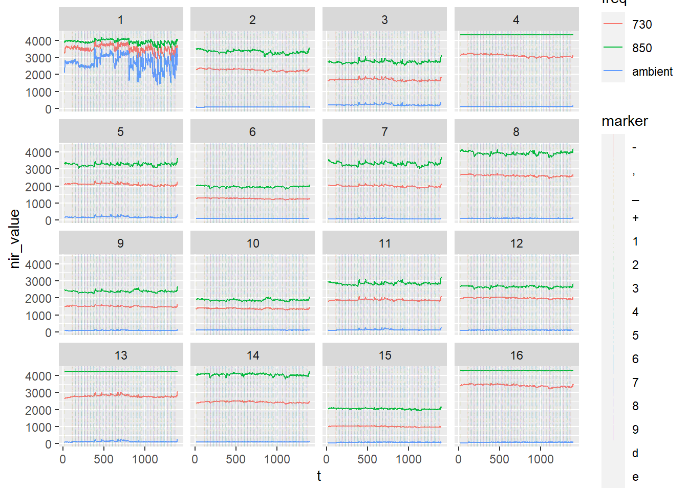
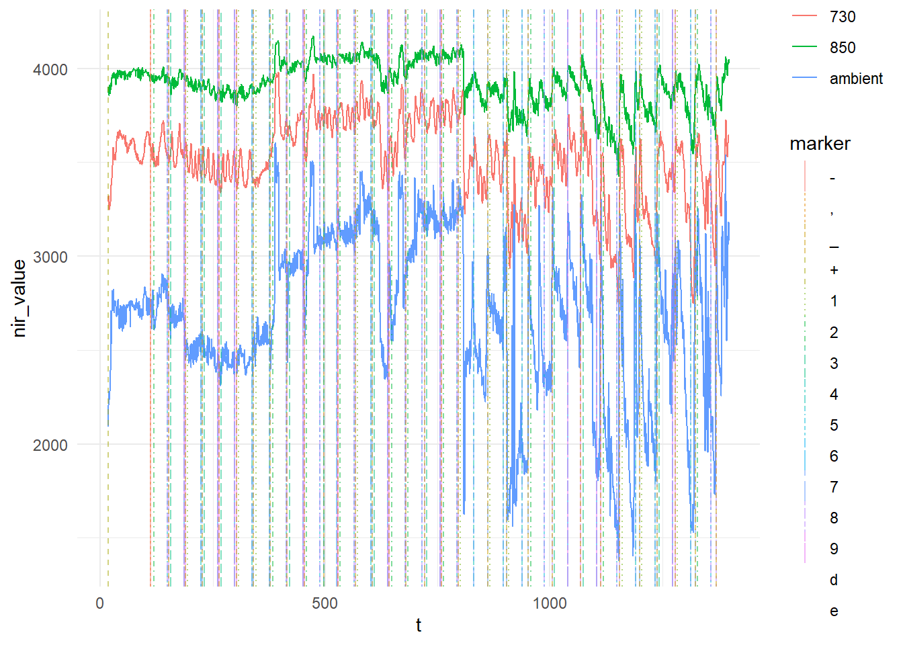

I am currently conducting a study that uses fNIRS to indirectly measure cognitive activity during a decision-making task. The fNIRS setup that we have is from BioPac, and though it seems to work well, the data files that are generated are made to be compatible with the software that the company also sells (convenient!).

This is irritating for a number of reasons. Firstly, the analysis software requires a license, meaning additional costs to install it on the computer of a research or graduate student who might be conducing an fNIRS study and want to analyse their data. Secondly, and perhaps more importantly, I dislike proprietary file formats. There are many established tools for analysing fNIRS data. They expect a standard format for the data (.nirs or .snirf).

Finally, most of the established analysis tools for fNIRS require MATLAB, so even if I convert the file format into .nirs, I would need to use MATLAB to analyse the data. I'm could do this, but I'm not normally a MATLAB user, so there's an additional time investment, along with the fact that MATLAB has an associated cost and computing resource requirements: this is a barrier to entry for students or even sharing code/analysis with other academics (who I work with). 

## The goal:

Essentially, I would like to be able to: 

  1. import the nirs data files from COBI studio into R
  1. identify the baseline values that are recorded at the beginning of the study 
  1. identify the optodes and their associated values through the duration of the study
  1. link the event markers to the data 
  1. visualise the data
  1. apply MBLL to the raw nirs data, to calculate Oxy and DeOxy values based on: the optode setup, relevant coefficient values, baseline values
  1. apply signal processing, such as: high/low pass filters, SMAR etc.
  1. Define event windows based on trial types and calculate averages across these different trials
  
## 1. import the nirs data files from COBI studio into R

### The .nir file

The first step in this process was understanding what data are generated from COBI Studio. A standard study will include 3 files:

  - a .nir file which is raw nirs data from each sensor/receptor combination at 730nm, 850nm and the ambient light sensor.
  - a .oxy file which includes automatically calculated oxy and deoxy calculations for each optode, based on the data in the .nirs file and the baseline values recorded at the start of the experiment (also present in the .nir file).
  - a .mrk file which contains the markers that were sent during the study and their associated time value.
  
I found a very good breakdown of the files in a Master's thesis by @vural2018 which included some useful images of the files. Here is an example if the .nir file:


As we can see from the image:

- there is a section of information including the date and the current/gain settings for this specific recording session. 

- There is an initial section recording baseline values

- There is a row where the baseline values are averaged

- The subsequent rows are the data from the study

If we look at the columns:

- The first column is a time index.

- Each 3 subsequent columns represent an optode, with values from  730nm, 850nm and the ambient light sensor.

### Reading the .nir file

With the above information, I could set about importing the data. The first step was to import the data in a raw format using *readlines()*:


```{r, comment = NA, echo=FALSE, message = FALSE, warnings = FALSE}
knitr::opts_chunk$set(comment = NA, echo=TRUE, message = FALSE, warnings = FALSE)

library(tidyverse)
```


```{r, warning=FALSE}


nirfile <- "CWILSON_1_test3_02210957.nir"
nir1 <- readLines(nirfile,   skipNul = TRUE) # read lines and skip empty rows
nir1 <- nir1 %>% as_tibble(nir1)  # convert to tibble for ease of use later

head(nir1)
```

The next step, which makes the file easier to separate and organise, is to assign a numerical value to each row:

```{r, warning=FALSE}
nir1 <- mutate(nir1, id = row_number()) # assign a value based on the row number
head(nir1)
```

### 2. Identify the baseline values recorded at the beginning of the study

Now we need to use the id column to make it easy to idenitfy which rows contain the baseline values, using str_detect(). We store the rows where the baseline begins and ends, and store this information as *baselineNirsValues*. In the last line, we can use strsplit() and unnest() to separate the values into columns:

```{r}
bStartRow <-  nir1 %>% filter(str_detect(.$value, 'Baseline values')) %>% select(id)
bEndRow <- nir1 %>% filter(str_detect(.$value, 'Baseline end')) %>% select(id)
baselineNirsValues <- nir1 %>% filter(id > bStartRow$id & id < bEndRow$id)
baselineNirsValues <- baselineNirsValues %>% mutate(value = strsplit(as.character(value), "\t")) %>%  unnest(value)
head(baselineNirsValues)
```

Since I am not certain whether this baseline will be useful (my study has an inter-trial period built in the the design, with a view to potentially using a moving baseline), I will come back to it another time.

### 3. Identify the optodes and their associated values through the duration of the study

We can use a similar approach to above to get the main nir data from each of the optodes. The end of the baseline can be used as the start point, and the last row can be used as an end point:

```{r}
nirsEndRow <-  nir1 %>% filter(str_detect(.$value, '-1	Device Stopped')) %>% select(id)
nirsDataValues <- nir1 %>% filter(id > bEndRow$id & id < nirsEndRow$id)

head(nirsDataValues)
```

However, the data are not labelled or presented in a useful way. We can use the image above to understand what each column represents. So we want the first column to be a time reference, and each 3 subsequent columns are values from  730nm, 850nm and the ambient light sensor, respectively. The below code seperates the data into columns and labels them appropriately:

```{r}

# separate nirs data columns 
## first column is time from start in seconds
nirsDataValues <- separate(nirsDataValues, col = value, sep = "\t", into = c("t", "op_1_730","op_1_ambient","op_1_850","op_2_730","op_2_ambient","op_2_850","op_3_730","op_3_ambient","op_3_850","op_4_730","op_4_ambient","op_4_850", "op_5_730","op_5_ambient","op_5_850", "op_6_730","op_6_ambient","op_6_850", "op_7_730","op_7_ambient","op_7_850", "op_8_730","op_8_ambient","op_8_850","op_9_730","op_9_ambient","op_9_850","op_10_730","op_10_ambient","op_10_850","op_11_730","op_11_ambient","op_11_850","op_12_730","op_12_ambient","op_12_850","op_13_730","op_13_ambient","op_13_850","op_14_730","op_14_ambient","op_14_850","op_15_730","op_15_ambient","op_15_850","op_16_730","op_16_ambient","op_16_850"), extra = "merge")

head(nirsDataValues)
```

One of the things we will see in the marker file later, is that the markers are recorded using a time index (like the first column of the nirs data) and also a row index, which starts at the first row of our nirs data (i.e. the first row after the baseline ends). To make it easier to join the marker data with the nirs data later, we are going to add a row index to match this, called *data_row*:

```{r}
# create a new column called data_row to match the markers
nirsDataValues <- mutate(nirsDataValues, data_row = row_number())

```

Finally, although the data are easier to read when they are displayed in a wide format(as above), analysis is easier if the data are in a long format. The next code will convert the data to long format to make it easier to analyse and visualise:

```{r}
nirs_long <- nirsDataValues %>%
  pivot_longer(
    cols = op_1_730:op_16_850,
    names_to = c("optode", "freq"),
    names_pattern = "op_(.*)_(.*)",
    values_to = "nir_value"
    
  )

head(nirs_long)
```

### 4. Link the event markers to the data 

To link the event markers to the data, we need to identify when the marker data starts and ends in the marker file and then to separate in into useful columns:

```{r}
markfile <- "CWILSON_1_test3_02210957.mrk"
mrk1 <- read_lines(markfile)
# convert to tibble
mrk1 <- mrk1 %>% as_tibble(mrk1) 
# add id column
mrk1 <- mutate(mrk1, id = row_number()) 
# marker start row
mStartRow <-  mrk1 %>% filter(str_detect(.$value, 'Freq Code:')) %>% select(id)
 # get marker data from start row to end of file
markerValues <- mrk1 %>% filter(id > mStartRow$id & id <= max(id))
# separate marker data into columns 
markerValues <- separate(markerValues, col = value, sep = "\t", into = c("t","marker", "data_row"), extra = "merge")
# make sure data_row is an integer and not a character
markerValues$data_row <- as.integer(markerValues$data_row)

head(markerValues)
```
If we wish, we can use the *data_row* column we created in the nirs file to link with the markers. The reason that we might want this is that the fNIRS typically records at a resolution of 2Hz, which is one data point every 500ms. However, the markers could be sent in between that 500ms window and, as such, will not align to a nirs reading at the exact time the marker was sent.  If we look at a particular data row in the marker file, and the nirs file, we can see that they don't align exactly in time. Note that in the marker file above, the first marker is sent at 17.206 seconds (t). However, we can see that the closest time point in the nirs data file is 17.189 seconds, meaning the marker was recorded 17ms before the next nirs data point was recorded:
```{r}
nirs_long %>%
  filter(data_row == 1) %>% head()
```


As such, we can use the *data_row* column to match the marker to the closest nirs data point. Because the marker data and the nirs data both have a column called *data_row* we can join them together using the *left_join*:

```{r}

## add markers to nirsdata 
mrk2 <- markerValues %>% select(data_row, marker)
nirs_with_markers <- left_join(nirs_long, mrk2, by = "data_row")

head(nirs_with_markers)

```

> Note: I'm not sure if I am going to maintain this practice in real analysis, because I need to fully explore the implications for aligning the markers with the fNIRS sample rate. However, I will keep this for now, as I continue to explore analysing the data

### 5. Visualise the raw data

Finally, for this post, the next step was to visualise the nirs data by each optode and wavelength. First, some clean up of variable types. Optode was kept as an integer so it will display in correct order.

```{r}

## clean up variable types 

nirs_with_markers$t <- as.double(nirs_with_markers$t)
nirs_with_markers$optode <- as.integer(nirs_with_markers$optode)
nirs_with_markers$freq <- as.factor(nirs_with_markers$freq)
nirs_with_markers$nir_value <- as.integer(nirs_with_markers$nir_value)
nirs_with_markers$marker <- as.factor(nirs_with_markers$marker)


```

Next, we can use ggplot to make a plot that displays the value for each of the 3 light frequencies (730, 850 and ambient). Using *facet_wrap* we can get a plot for each of the 16 optodes:

```{r firstplot, fig.show = 'hide'}
nirs_with_markers %>%
ggplot(aes(x = t, y = nir_value, color = freq)) +
  geom_line() +
  facet_wrap(.~ optode) 

```


To add the markers, we use a vline geom, but need to use the *ggnewscale* package to allow the colours attribute of the vline to not get mixed up with the colour attribute of the lines already on the plot. Linetype and colour of the vline is set by marker, allowing us to see different markers on the plot. We can also adjust alpha value to increase transparency of markers:


```{r secondplot, fig.show = 'hide'}
library(ggnewscale)
nirs_with_markers %>%
ggplot(aes(x = t, y = nir_value, color = freq)) +
  geom_line() +
  ggnewscale::new_scale_color() +
  geom_vline(data = nirs_with_markers %>% filter(!is.na(marker)), aes(xintercept = t, linetype  = marker, colour = marker), alpha = 0.1) +
  facet_wrap(.~ optode) 

```



Then, we can adjust the look of the plot using theme:

```{r lastplot, fig.show = 'hide'}
nirs_with_markers %>%
ggplot(aes(x = t, y = nir_value, color = freq)) +
  geom_line() +
  ggnewscale::new_scale_color() +
  geom_vline(data = nirs_with_markers %>% filter(!is.na(marker)), aes(xintercept = t, linetype  = marker, colour = marker), alpha = 0.1) +
  facet_wrap(.~ optode) + 
  theme_minimal()

```


Finally, to show that the markers are actually on the plot (but hard to see when the plot is small), we can look at just 1 optode:

```{r 1optode, fig.show = 'hide'}
nirs_with_markers %>%
  filter(optode == 1) %>%
ggplot(aes(x = t, y = nir_value, color = freq)) +
  geom_line() +
  ggnewscale::new_scale_color() +
  geom_vline(data = nirs_with_markers %>% filter(!is.na(marker)), aes(xintercept = t, linetype  = marker, colour = marker), alpha = 0.5) +
  theme_minimal()

```



# References


